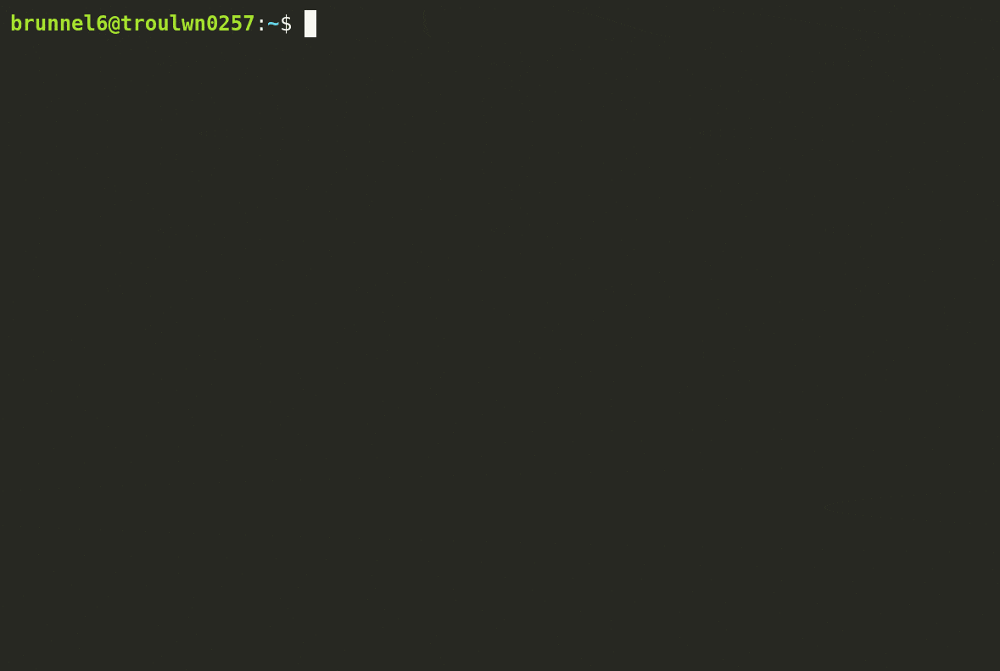

# :package: try

**Quickly try out npm packages inside a container.**

[](https://www.npmjs.com/package/try-pkg)

[](https://circleci.com/gh/BrunnerLivio/try/tree/master)



## Purpose

As a developer working with NodeJS you often stumble upon packages you quickly want to try out.
Installing these packages on your host system gets it polluted real quick.

`try` tries to keep your host system clean while testing out npm packages.
This CLI tool quickly starts up a [Docker](https://www.docker.com/) container
and installs your specified packages, so you can try them out!

## Usage

You can print the usage by executing `try --help`.

```shell

Usage: try [options]

Quickly try out npm packages inside a container

Options:
  -V, --version              output the version number
  -v, --verbose              Verbosity value
  -i, --image [image]        The docker image which it should pull from (default: "node")
  --image-version [version]  Specify the node image version (default: "latest")
  --no-cleanup               If set to true, the created container will not get cleaned up
  --silent                   If the program should not print any log statements
  --ts                       If it the program should use TypeScript
  -h, --help                 output usage information

```

## Installation

### Prerequisites

- [Node >= 8](https://nodejs.org/en/download/package-manager/)
- [Docker](https://docs.docker.com/install/)

### npm package

To install `try` using `npm` run:

```shell

npm install -g try-pkg

```

### From source

To install it from source you need to clone this repository,
install the dependencies using `npm` and execute the program.

```shell

git clone https://github.com/BrunnerLivio/try.git
cd try
npm install
npm start

```

## Other

Inspired by [timofurrer/try](https://github.com/TimoFurrer/try) - Thanks buddy :)

